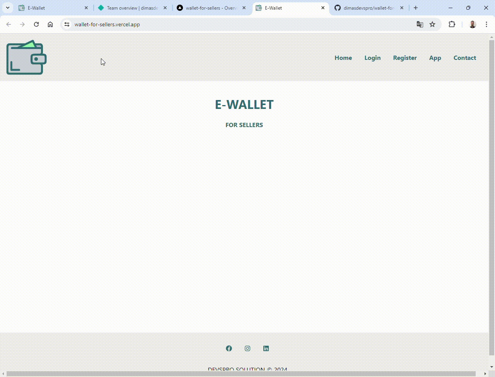

<h3 align="center">Wallet for Sellers</h3>
<p align="center">-<green>"> -<green>"></p>



### Indice

* [Sobre](#sobre)
* [Status do Projeto](#status-do-projeto)
* [Pré-requisitos](#pré-requisitos)
* [Testes](#testes)
* [Tecnologias Utilizadas](#tecnologias-utilizadas)
* [Autor](#autor)
* [Licença](#licença)


### Sobre 
[↩](#indice)

<p>Aplicativo que armazena contatos para vendedores.</p>

### Status do Projeto 
[↩](#indice)

<h4> 	
Em andamento!
</h4>

### Pré-requisitos 
[↩](#indice)

Para começar, você vai precisar instalar em sua máquina as seguintes ferramentas:

- Um repositório para seu projeto [Git](https://git-scm.com);

- Um editor de código [VSCode](https://code.visualstudio.com/);

### Testes 
[↩](#indice)

```bash
# Baixe o editor equivalente para a sua plataforma
$ https://code.visualstudio.com/

# Vá para a pasta de downloads e execute o arquivo

# Acesse o terminal/cmd de sua plataforma (Win, Linux, etc)

# Clone este repositório com o seguinte comando abaixo
$ git clone https://github.com/dimasdevspro/wallet-for-sellers-r

# Ainda no terminal, acesse a pasta com mais um comando
$ cd wallet-for-sellers-r

# Agora digite este comando, para editar/testar o projeto
$ code .
```

### Tecnologias utilizadas 
[↩](#indice)

As seguintes ferramentas foram usadas na construção do projeto:

- [VSCode](https://code.visualstudio.com/);
- [Git](https://git-scm.com).


### Autor 
[↩](#indice)

---

<a href="https://github.com/dimasdevspro">
 
 <br />
 <sub><b>Dimas Alves Pereira</b></sub></a> <a href="https://github.com/dimasdevspro" title="Github"></a>


Feito com ❤️ por Dimas 👋🏽 Entre em contato!

[](https://www.instagram.com/dimasdevspro/) [](https://www.linkedin.com/in/dimas-apereira/) 
[](mailto:dimasdevspro@gmail.com)


### Licença 
[↩](#indice)

